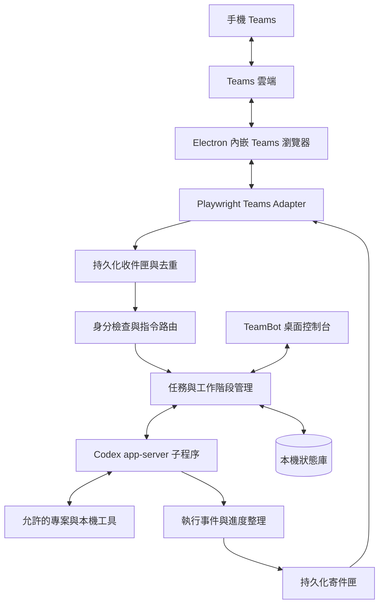

# TeamBot 架構提案

日期：2026-09-23。狀態：設計草案，尚未進入產品實作。

已確認需求：同一帳號在「與自己聊天」發送指令，以及在指定群組聊天操作，兩者都納入首版。

## 1. 使用者目標

使用者離開電腦後，仍可透過手機 Teams：

1. 選擇已登記的本機專案，交辦 Codex 工作。
2. 延續同一項工作，補充要求、回答問題或批准待執行操作。
3. 查詢目前狀態、最近活動、測試結果和最後輸出。
4. 停止工作，或在工作完成、失敗、需要決策時收到回報。

TeamBot 是遠端操作入口；Codex 負責理解與執行要求。Teams 訊息不是直接交給 shell 執行的命令字串。

## 2. 建議的整體架構



整條路徑由電腦主動連出 Teams 與 Codex 使用的模型服務；手機不直接連入電腦，也不需要為此公開 shell 或 Codex 連接埠。電腦必須開機、保持網路連線，且 TeamBot 與 Teams 登入仍有效。

### 模組分工

| 模組 | 責任 |
|---|---|
| Desktop Shell | Teams 登入、專案登記、配對、啟停遠端控制、工作列表與活動紀錄 |
| Browser Host | 自有 WebContentsView、獨立 persistent partition、登入視窗與生命週期 |
| Teams Adapter | 讀取指定對話的新訊息、確認對話身分、序列化傳送與結果核對 |
| Inbox / Router | 保存訊息、去重、驗證來源、解析 TeamBot 指令、分派任務 |
| Supervisor | 綁定 Teams 對話與 Codex thread、排隊、同專案鎖、取消與復原 |
| Codex Adapter | 啟動本機 Codex、握手、送出要求、接收事件、回答批准／輸入要求 |
| Progress / Outbox | 回報可見執行活動、合併進度、分段傳送、保存待送與不確定結果 |
| Store | 保存配對、工作、事件、收送紀錄與稽核資料；不放進 Git |

建議 Electron + TypeScript + playwright-core；持久化使用 SQLite。UI 和任務執行解耦：Electron 擁有 Teams 瀏覽器，獨立 supervisor 擁有 Codex 子程序；本機 IPC 使用具使用者存取限制的 named pipe 或等效機制。瀏覽器控制端點僅限 loopback，不對外公開。

## 3. Codex 怎麼收到用戶要求

**建議以 `codex app-server --listen stdio://` 作為正式介接點。** TeamBot 是它的客戶端，使用 JSON 訊息往返，持續讀取 stdout 事件；stderr 另作診斷。

協定生命週期：

1. 啟動子程序，完成 `initialize` / `initialized` 握手。
2. 新工作使用 `thread/start`；已有工作使用 `thread/resume`。
3. 將 Teams 指令中的要求放入 `turn/start` 的文字 input。
4. 接收 item 與 turn 事件，更新狀態並安排 Teams 回報。
5. 執行中追加要求使用 `turn/steer`，帶入明確的 `expectedTurnId`。
6. 停止要求使用 `turn/interrupt`；收到實際結束事件才標示已停止。
7. Codex 要求批准或補充資料時，TeamBot 轉送到原對話並回覆對應的 request ID。

這些能力來自 [Codex App Server 官方文件](https://learn.chatgpt.com/docs/app-server)。本機已確認 `codex-cli 0.156.1` 有 app-server、stdio 與 schema 產生命令；實作前應從選定版本產生 TypeScript／JSON schema，驗證欄位與事件，不假設其他版本完全相同。

### 介接選項比較

| 方法 | 適合用途 | 本計畫定位 |
|---|---|---|
| app-server | 長時間雙向互動、進度、追加要求、取消與批准 | 主要方式 |
| `codex exec --json` | 一次性工作、逐行接收事件、完成後續跑 | 概念驗證或批次工作備案；不宣稱具備完整互動批准能力 |
| PTY / ConPTY 控制 Codex TUI | 使用者需要真正可互動的 Terminal 畫面 | 後續獨立模式，必須由 TeamBot 啟動並持有 PTY |

`exec --json` 的串流與續跑能力見 [Non-interactive mode](https://learn.chatgpt.com/docs/non-interactive-mode)。

MVP 管理的是 **TeamBot 自己啟動的 Codex 工作階段**。桌面控制台可顯示文字活動紀錄，但它不是原始 TUI 畫面的鏡像。任意已經開啟的 Terminal 不應承諾可直接接管；若需求是同步操作既有視窗，需要另設計 PTY 啟動入口及單一寫入者機制。

## 4. 手機操作提案

以 `!tb` 為建議文字前綴，降低與 Teams 自身指令和一般聊天的衝突。以下是產品命令提案，尚未實作。

| 手機訊息 | 行為 |
|---|---|
| `!tb help` | 顯示簡短操作說明 |
| `!tb projects` | 列出本機預先登記的專案別名 |
| `!tb run TeamBot 請檢查登入失敗原因` | 建立工作，立即回覆工作編號 |
| `!tb status T001` | 讀取保存的進度與最近事件，不另啟動模型工作 |
| `!tb continue T001 再補上測試` | 在同一 Codex thread 開始下一輪；執行中則明示排隊 |
| `!tb steer T001 優先處理 Windows 問題` | 將要求追加到指定執行中的 turn |
| `!tb stop T001` | 請求中止；先回覆「停止中」，再回報實際結果 |
| `!tb approve A7K2` / `!tb deny A7K2` | 對指定待決操作批准一次或拒絕 |
| `!tb answer Q8F3 使用第二種方案` | 回答指定問題 |
| `!tb result T001` | 取得完成摘要與可提供的產物資訊 |

一般自然語言可在後續加入「綁定目前工作」模式。MVP 用明確前綴與工作 ID，避免把閒聊、引用文字或模糊的「繼續」派給錯誤專案。控制命令由固定 parser 解讀；工作要求直接作為用戶文字傳給 Codex，不另外讓模型決定有沒有權限。

### 一次完整流程

```text
你：!tb run TeamBot 修正登入錯誤並執行相關測試
TeamBot：[TB T001] 已接收，專案 TeamBot，準備執行。
TeamBot：[TB T001] 已開始檢查登入流程。
你：!tb status T001
TeamBot：[TB T001] 執行中；最近活動：執行登入測試；已用時 2 分鐘。
TeamBot：[TB T001] 需要批准 A7K2：<具體操作與範圍>。
你：!tb approve A7K2
TeamBot：[TB T001] 已完成；修改摘要：…；測試結果：…。
```

範例狀態僅示意產品行為，不是已完成的測試證據。完成不自動代表要 commit/push，依各專案已授權的工作規則決定。

## 5. Teams 帳號與來源辨識

必須在桌面端完成配對與專案授權後才開啟遠端接單。配對記錄 Teams 帳號／租戶、固定對話 ID、允許的發話者與專案清單；不能只靠聊天室標題或顯示名稱。

- **同帳號的「與自己聊天」：首版必要。** 手機輸入與 TeamBot 回報是相同作者，不能忽略所有自己發出的訊息。用固定指令前綴、已送出 message ID 與輸出格式區分；回報以 `[TB ...]` 開頭且不被 parser 當作命令。
- **指定群組：首版必要。** 加入成員 ID allowlist，限制誰可啟動、查看或批准特定工作。一般群組訊息不派工，只有以 `!tb` 開頭且通過來源驗證的訊息進入路由。
- **另一個 TeamBot 帳號的一對一對話：可選擴充。** 只接受已配對使用者的訊息。

首階段必須各別驗證自己聊天與群組。必須在實際 Teams 頁面驗證穩定的 chat/message/sender ID 是否取得得到。若只能取得顯示名稱，不能把它當成完成來源驗證；需調整支援範圍，或再評估其他 Teams transport。實際租戶的登入／條件式存取亦是早期驗證項目。

每個啟用的對話綁定自己的 Browser Host 表面與 checkpoint，避免靠不停切換同一頁輪詢不同對話；各表面共用登入 partition，但讀寫時核對各自的 chatId。首版限制同時啟用的對話數並顯示每個對話的連線狀態。隱藏表面是否仍能收到新訊息，須在 Phase 0 實測，不能只以頁面存在判定正常。

### 群組工作的預設權限

| 操作 | 預設規則 |
|---|---|
| 啟動工作 | 已登記的群組 + allowlist 成員 + 該群組允許的專案 |
| 查詢進度／結果 | 僅同一來源群組的 allowlist 成員；不以猜測 jobId 跨對話查詢 |
| 追加、繼續或停止 | 工作發起人與桌面端指定管理者 |
| 批准與回答待決問題 | 工作發起人中具該範圍權限者，或指定管理者 |
| 修改群組／成員／專案權限 | 桌面端設定，不接受一般群組文字直接擴權 |

使用者在群組建立的工作，其回報對群組成員可見；因此專案要先被桌面端明確授權可在該群組公開摘要。自己聊天的工作不因出現在同一帳號就向群組公開。首版以整個群組對話及 jobId 分流，支援巢狀回覆關聯留待實際 Teams DOM 能力驗證。

同一帳號發出的 TeamBot 訊息未必在手機形成新通知；「能在 Teams 看見回報」與「收到手機推播」分別驗證，不先保證推播。若日後要求每次回報都通知本人，再依實際 Teams 行為評估替代帳號／傳輸方式。

引用或轉寄的內容只作要求資料，不可繼承原作者控制權限。批准代碼綁定原始操作、Codex request ID、thread/turn、使用者與對話，具有效期限且只使用一次。

## 6. 進度、任務與並行

每個 TeamBot 工作保存：jobId、來源對話／使用者、projectId、cwd、Codex threadId、activeTurnId、狀態、開始時間、最近事件時間與最後結果。

```text
queued → starting → running → completed / failed
                       ↕
                 waiting_input / waiting_approval
running / waiting_* → stopping → cancelled
程序失聯 → interrupted / unknown → 核對狀態後再決定後續
```

狀態查詢從 supervisor/store 取得，不等待 Codex 回覆，因此正在執行工具時仍能回報。

- 啟動、完成、失敗、需要批准／輸入立即回報。
- 有新的重要進度時合併回報，建議最多每 30 秒一則；不逐 token 洗版。
- 沒有新事件時，`status` 明列最近事件時間，不編造完成百分比或預估時間。
- 傳回模型的對外訊息、工具階段與結果；不承諾提供模型內部思考。
- MVP 一次執行一項工作，其餘明示排隊。同一工作 thread 一次只有一個 active turn；後續多工使用專案鎖或獨立 worktree。

## 7. 訊息與故障處理

### 收件

使用 `(tenant/account, chatId, messageId)` 去重，先保存再派工。初次配對以當前訊息建立基線，不執行歷史指令；編輯舊訊息不觸發新工作，使用者需傳新訊息。重啟則核對 checkpoint 與未完成紀錄，不能把全部可見歷史當作新要求。

Teams 可能只渲染部分歷史，MVP 不能保證離線期間的所有要求一定可讀。斷線恢復時回報缺口；過期或無法確認時序的工作要求標為待重新確認，不直接補執行。

### 派工與回報

收件、工作狀態及寄件匣以交易保存。對外呼叫與本機交易不能構成全域原子操作，因此不承諾 exactly-once：若傳送或 turn/start 後失聯，先核對已知訊息／turn，不盲目重送具有副作用的要求。

回報綁定原 chatId；傳送前後均核對對話。所有讀寫由同一 adapter 序列化，避免人工切換聊天室時回錯人。一般訊息可拆段，每段有 jobId、事件序號和段號；「送出狀態不明」保留在 outbox 供核對。

Teams 失聯與 Codex 執行狀態分開記錄。已啟動且不需新批准的工作可繼續，回報暫存；需批准時保持等待。supervisor 重啟後先核對 Codex thread／turn，無法確認的工作標為 unknown，不自動重跑。

關閉主視窗預計縮到通知區；明確退出才停止接單並協調正在執行的工作。作業系統睡眠期間無法保持遠端控制，桌面端應清楚顯示這項前提。

## 8. 本機權限與資料

桌面端登記專案別名與正規化路徑；手機不能任意提交 cwd。Codex 使用選定的既有登入／模型設定，TeamBot 不需重建 ChatGPT 網頁模型代理，也不以複製瀏覽器 cookie 的方式登入。

執行權限由設定的 Codex sandbox/approval policy 與本機授權專案共同決定；UI 必須顯示實際有效設定。若 Codex 提出批准要求，TeamBot 原樣保留操作範圍並轉送；不把每則手機訊息當作永久擴權。

若日後開啟供 Codex 讀取的 TeamBot MCP 工具，模型只可查詢自己綁定工作的訊息與狀態，不能修改發話者 allowlist、替自己批准或切換其他用戶專案。

設定、Teams profile、SQLite 和本機日誌存放於使用者資料目錄。Git 只收原始碼、文件與去識別測試 fixture。回報日誌不包含 token、cookie 或整份環境變數。

## 9. 參考與移植範圍

參考專案：`../codex-chatgpt-web`。

檢視時的 HEAD：`3a68045533517673c6fe90b5d5c017c2799de7fb`。該專案既有未追蹤資料保持原狀，未做修改。

| 既有來源 | 可借用的設計 | TeamBot 需要的新邏輯 |
|---|---|---|
| `launcher/electron/browser-host.cjs` | 自有 WebContentsView、登入 popup、persistent partition、view ownership | Teams 網域、登入判定、指定對話綁定 |
| `src/launcher-browser-host.ts` | CDP 僅連自有表面、descriptor 與生命週期驗證 | TeamBot adapter 的瀏覽器連線契約 |
| `launcher/electron/runtime.cjs` | 子程序啟停、診斷與復原 | Codex app-server supervisor |
| `launcher/electron/process-tree.cjs` | 程序樹管理 | 只清理 TeamBot 持有的程序 |
| `launcher/electron/hitl-terminal.cjs` | Windows 終端啟動、參數與路徑處理的經驗 | 選用的 PTY 模式，不能直接視為 Codex 雙向介面 |
| `src/dev-chat/session.ts` | 具版本的 session 存取與驗證 | Teams/job/thread 綁定和資料庫 |

不整包搬入 ChatGPT Responses bridge、模型目錄、tunnel 與 HITL harness；它們解決的是模型供應與工具橋接，與本案手機控制入口不同。

移植時記錄上游 commit、來源檔案與修改內容，保留其 MIT 版權／授權文字，形成 TeamBot 自己可維護的 source code；不依賴旁邊專案才能執行。目前只做架構參考，尚未複製上游程式。

## 10. 尚待決定

1. 首版是否接受 TeamBot 管理的 Codex 工作階段；若要求原始 TUI 操作，PTY 模式需升為主要範圍。
2. 首批允許專案、指定群組、成員與批准權限及保留紀錄期限，在桌面配對設定時指定。

以上是設計決策，不是開始實作的暗示。先確認產品方向，再按驗收計畫推進。
